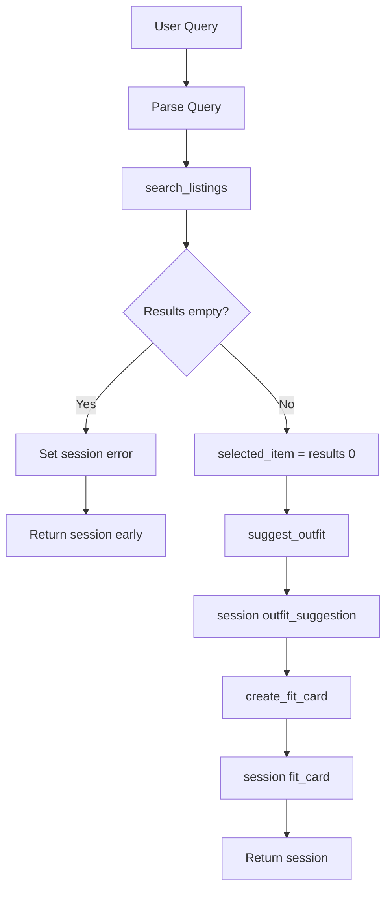

# FitFindr — planning.md

> Complete this document before writing any implementation code.
> Your spec and agent diagram are what you'll use to direct AI tools (Claude, Copilot, etc.) to generate your implementation — the more specific they are, the more useful the generated code will be.
> Your planning.md will be reviewed as part of your submission.
> Update it before starting any stretch features.

---

## Tools

List every tool your agent will use. For each tool, fill in all four fields.
You must have at least 3 tools. The three required tools are listed — add any additional tools below them.

### Tool 1: search_listings

**What it does:**
Searches the mock secondhand listings dataset for items matching a keyword description, with optional size and maximum-price filters. Results are ranked by relevance score (keyword overlap with title, description, and style tags).

**Input parameters:**
- `description` (str): Keywords describing what the user wants (e.g., `"vintage graphic tee"`). Tokenized into lowercase words for matching.
- `size` (str | None): Optional size filter. Case-insensitive substring match against each listing's `size` field (e.g., `"M"` matches `"S/M"`). `None` skips size filtering.
- `max_price` (float | None): Optional maximum price (inclusive). Listings with `price > max_price` are excluded. `None` skips price filtering.

**What it returns:**
A `list[dict]` of matching listing dicts, sorted by relevance score (highest first). Each dict contains: `id`, `title`, `description`, `category`, `style_tags`, `size`, `condition`, `price`, `colors`, `brand`, `platform`. Returns `[]` (empty list, no exception) when nothing matches.

**What happens if it fails or returns nothing:**
The agent sets `session["error"]` to a helpful message explaining that no listings matched, suggests broadening the search (remove size/price filters or try different keywords), and returns the session immediately. It does **not** call `suggest_outfit` or `create_fit_card`.

---

### Tool 2: suggest_outfit

**What it does:**
Given a thrifted listing and the user's wardrobe, calls the Groq LLM (`llama-3.3-70b-versatile`) to suggest 1–2 complete outfit combinations. If the wardrobe is empty, returns general styling advice for the new item instead of referencing specific wardrobe pieces.

**Input parameters:**
- `new_item` (dict): A listing dict from `search_listings` (must include at least `title`, `description`, `style_tags`, `category`, `colors`).
- `wardrobe` (dict): Wardrobe dict with an `items` key containing a list of wardrobe item dicts (`name`, `category`, `colors`, `style_tags`, optional `notes`). May have an empty `items` list.

**What it returns:**
A non-empty `str` with 1–2 outfit suggestions or general styling advice. Each suggestion names specific pieces and describes how to wear them (fit tips, layering, vibe).

**What happens if it fails or returns nothing:**
- **Empty wardrobe:** Not a failure — the tool returns general styling advice (what categories/colors pair well, what vibe the item suits) without crashing.
- **LLM/API error:** Returns a fallback string explaining the issue and offering basic pairing advice based on the item's `style_tags` and `category`.
- The agent always stores the result in `session["outfit_suggestion"]` and proceeds to `create_fit_card` unless the string indicates a critical failure.

---

### Tool 3: create_fit_card

**What it does:**
Calls the Groq LLM to generate a short, casual, shareable outfit caption (Instagram/TikTok style) from the outfit suggestion and the thrifted item details. Uses higher temperature (0.9) so captions vary across runs.

**Input parameters:**
- `outfit` (str): The outfit suggestion string from `suggest_outfit()`.
- `new_item` (dict): The listing dict for the thrifted item (uses `title`, `price`, `platform`).

**What it returns:**
A `str` of 2–4 sentences usable as a social caption. Mentions item name, price, and platform naturally once each. Returns a descriptive error message string (not an exception) if `outfit` is empty or whitespace-only.

**What happens if it fails or returns nothing:**
- **Empty outfit input:** Returns `"Cannot create a fit card: no outfit suggestion was provided. Run suggest_outfit first."` — no exception raised.
- **LLM/API error:** Returns a fallback caption template built from `new_item` fields so the user still gets something shareable.

---

### Additional Tools (if any)

None for the required project scope.

---

## Planning Loop

**How does your agent decide which tool to call next?**

The agent uses a **conditional sequential loop** (not a fixed pipeline). Each step checks the previous step's output before proceeding:

1. **Parse query** — Extract `description`, `size`, and `max_price` from the natural language query using regex (price patterns like `under $30`, size patterns like `size M`). Store in `session["parsed"]`.

2. **Call `search_listings`** — Pass parsed parameters. Store results in `session["search_results"]`.
   - **If `search_results` is empty:** Set `session["error"]` with actionable advice, return session early. **Stop here** — do not call downstream tools.
   - **If results exist:** Set `session["selected_item"] = search_results[0]` (top match by relevance).

3. **Call `suggest_outfit`** — Only reached when `selected_item` is set. Pass `session["selected_item"]` and `session["wardrobe"]`. Store result in `session["outfit_suggestion"]`.

4. **Call `create_fit_card`** — Only reached when `outfit_suggestion` is a non-empty string. Pass `session["outfit_suggestion"]` and `session["selected_item"]`. Store result in `session["fit_card"]`.

5. **Return session** — Done when fit card is generated or an error halted the loop early.

The loop is **not** unconditional: the no-results branch skips steps 3–4 entirely, which is the key behavioral difference the grader checks for.

---

## State Management

**How does information from one tool get passed to the next?**

All state lives in a single `session` dict created by `_new_session()` at the start of each interaction:

| Field | Set when | Used by |
|-------|----------|---------|
| `query` | Session init | Reference / debugging |
| `parsed` | After query parsing | `search_listings()` inputs |
| `search_results` | After search | Selecting top item |
| `selected_item` | After search (if results) | `suggest_outfit()`, `create_fit_card()` |
| `wardrobe` | Session init (from UI or test) | `suggest_outfit()` |
| `outfit_suggestion` | After suggest | `create_fit_card()` |
| `fit_card` | After fit card | Final output to user |
| `error` | On early termination | UI error panel |

No tool re-parses the user query or re-searches. The listing found in step 1 flows directly into steps 2 and 3 via `session["selected_item"]`. The outfit string from step 2 flows into step 3 via `session["outfit_suggestion"]`.

---

## Error Handling

For each tool, describe the specific failure mode you're handling and what the agent does in response.

| Tool | Failure mode | Agent response |
|------|-------------|----------------|
| `search_listings` | No results match the query | Sets `session["error"]` to: `"No listings found for '<description>' (size: <size>, max price: $<price>). Try removing the size or price filter, or use broader keywords like 'graphic tee' instead of a very specific phrase."` Returns session with `outfit_suggestion` and `fit_card` as `None`. Does not call downstream tools. |
| `suggest_outfit` | Wardrobe is empty | Tool returns general styling advice (not an error). Agent stores it in `session["outfit_suggestion"]` and continues to `create_fit_card`. UI shows advice in the outfit panel. |
| `create_fit_card` | Outfit input is missing or incomplete | Tool returns error message string: `"Cannot create a fit card: no outfit suggestion was provided..."` Agent stores this in `session["fit_card"]` so the user sees what went wrong in the fit card panel. |

---

## Architecture

```
User query + wardrobe choice
         │
         ▼
    run_agent() ──► _new_session()  ──► session dict initialized
         │
         ▼
    parse_query() ──► session["parsed"] = {description, size, max_price}
         │
         ▼
    search_listings(description, size, max_price)
         │
         ├── results = [] ──► session["error"] = helpful message ──► RETURN (early exit)
         │
         └── results = [item, ...]
                  │
                  ▼
         session["selected_item"] = results[0]
                  │
                  ▼
    suggest_outfit(selected_item, wardrobe)
                  │
                  ▼
         session["outfit_suggestion"] = "..."
                  │
                  ▼
    create_fit_card(outfit_suggestion, selected_item)
                  │
                  ▼
         session["fit_card"] = "..."
                  │
                  ▼
              RETURN session
                  ▲
                  └── error path returns here (fit_card / outfit remain None)
```



---

## AI Tool Plan

**Milestone 3 — Individual tool implementations:**

- **Tool:** Cursor AI (Claude)
- **Input:** Tool 1/2/3 spec blocks from this planning.md (inputs, return values, failure modes) plus the `load_listings()` docstring from `utils/data_loader.py`
- **Expected output:** Implemented functions in `tools.py` — one tool at a time
- **Verification:** Run each tool from the terminal with hardcoded inputs before moving to the next. For `search_listings`, confirm empty list (not exception) for impossible queries. For LLM tools, confirm non-empty strings and that `create_fit_card("", item)` returns an error message string.

**Milestone 4 — Planning loop and state management:**

- **Tool:** Cursor AI (Claude)
- **Input:** Architecture diagram, Planning Loop section, State Management section, and the TODO steps in `agent.py`
- **Expected output:** `run_agent()` in `agent.py` and `handle_query()` in `app.py`
- **Verification:** Run `python agent.py` — happy path prints title + outfit + fit card; no-results path prints error and leaves `fit_card` as `None`. Print `session["selected_item"]` to confirm it matches what went into `suggest_outfit`.

---

## A Complete Interaction (Step by Step)

Write out what a full user interaction looks like from start to finish — tool call by tool call. Use a specific example query.

**Example user query:** "I'm looking for a vintage graphic tee under $30. I mostly wear baggy jeans and chunky sneakers. What's out there and how would I style it?"

**Step 1:**
Agent parses the query → `description="vintage graphic tee"`, `size=None`, `max_price=30.0` (wardrobe context in the query is ignored for search; the example wardrobe from the UI is used instead).

Calls `search_listings("vintage graphic tee", size=None, max_price=30.0)`.

Returns 3+ matches; top result: **Vintage Band Tee — Faded Grey** (`lst_033`, $19.00, Depop, size L).

Agent sets `session["selected_item"]` to that listing dict.

**Step 2:**
Calls `suggest_outfit(new_item=selected_item, wardrobe=get_example_wardrobe())`.

LLM returns something like: *"Pair the faded band tee with your baggy straight-leg jeans and chunky white sneakers for an easy 90s grunge look. Layer your vintage black denim jacket over top if it's chilly — roll the tee sleeves once for shape."*

Agent stores this in `session["outfit_suggestion"]`.

**Step 3:**
Calls `create_fit_card(outfit=session["outfit_suggestion"], new_item=selected_item)`.

LLM returns something like: *"thrifted this faded band tee off depop for $19 and it's giving full 90s grunge with my baggy jeans + chunky sneakers 🖤 full fit on my story"*

Agent stores this in `session["fit_card"]`.

**Final output to user:**
Three UI panels:
1. **Top listing:** Vintage Band Tee — Faded Grey, $19.00, Depop, Good condition, size L
2. **Outfit idea:** The styling suggestion referencing wardrobe pieces
3. **Fit card:** The shareable Instagram-style caption

FitFindr is a multi-tool agent that helps users search secondhand listings, evaluate how a find fits their existing wardrobe, and produce a shareable outfit caption. `search_listings` runs first when the user describes what they want; if it returns nothing, the agent stops and tells the user how to adjust their search. When a match is found, `suggest_outfit` and `create_fit_card` run in sequence using state from the session — no re-entry required.
